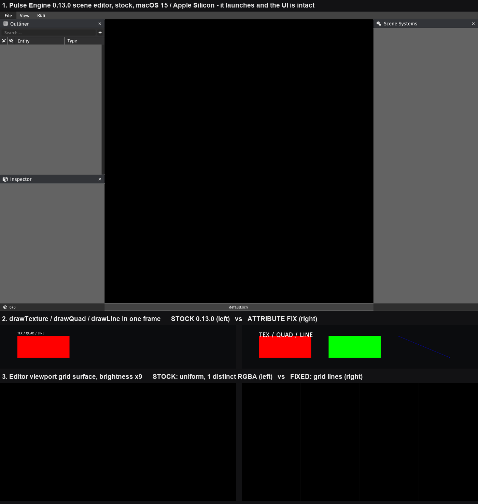

# `drawQuad` / `drawLine` render nothing on macOS — root cause, editor impact, and what to do about it

**Date:** 2026-08-06
**Engine:** Pulse Engine 0.13.0 (`no.njoh:pulse-engine`), plus an unreleased build from the
upstream source checkout for the controlled experiments
**Platform under test:** macOS / Apple Silicon, OpenGL 3.3 core profile via LWJGL/GLFW
**Status of the question:** root cause **established**, with a reproduced-and-reversed experiment

---

## Summary

1. **The root cause is not the shader version.** It is a vertex-attribute *binding type* mismatch
   in `QuadRenderer` and `LineRenderer`: the engine binds a colour attribute with
   `glVertexAttribPointer(GL_FLOAT, …)` while the shader declares it as `in uint`. That is
   undefined behaviour under the OpenGL spec, and Apple's driver resolves the undefined value in a
   way that yields alpha 0. The comment in `render/Draw.kt` blaming `#version 150 core` is wrong
   and should be corrected.
2. **It is almost certainly macOS-only** (confidence: high, ~85%). Not verified on Windows — we
   have no Windows machine. Section 3 says exactly what would confirm it.
3. **The scene editor is usable on this Mac.** It launches, and the whole panel/text/inspector/
   outliner UI renders correctly. What is lost is the viewport grid, the entity selection box and
   resize dots, the rubber-band selection rectangle, the colour picker's gradient box, and the text
   caret — all of which are drawn with `drawLine`/`drawQuad`. Degraded, not blocked.
4. **There is a fork-free fix that works today**, verified end to end: shadow two shader files from
   our own `src/main/resources`. It repairs `drawQuad`/`drawLine` for our code *and* for the
   engine's editor, with byte-exact colour fidelity. It costs two small text files and one build
   line.
5. **Recommendation: take the fork-free fix for the editor's sake, keep `fillRect` in the game, and
   send upstream a one-line PR as a courtesy with no dependency on it being merged.** Do not fork,
   do not vendor a pinned artefact. Rationale and the one real risk are in §6.



*Panel 1 — the Pulse Engine scene editor running on this Mac against stock 0.13.0. Panel 2 —
`drawTexture` / `drawQuad` / `drawLine` issued in a single frame: stock (left) drops the quad and
the line, the attribute fix (right) restores both with `#version 150 core` untouched. Panel 3 —
the editor's viewport grid surface at 9× brightness: stock is a uniform image with exactly one
distinct RGBA value, i.e. no grid at all; fixed shows the grid lines.*

---

## 1. Root cause

### 1.1 What the code actually does

Four renderers pack an RGBA colour into the vertex stream as a 32-bit integer bit-cast into a
float slot (`SurfaceConfig.kt:62`):

```kotlin
currentDrawColor = intBitsToFloat(((r*255).toInt() shl 24) or … or (a*255).toInt())
```

All four shaders then declare that attribute as an **integer**:

| shader | attribute declaration |
|---|---|
| `quad.vert` | `in uint color;` |
| `line.vert` | `in uint rgbaColor;` |
| `texture.vert` | `in uint color;`, `in uint texHandle;` |
| `glyph.vert` | `in uint color;`, `in uint texHandle;` |

But only two of the four renderers *bind* it as an integer:

| renderer | `VertexAttributeLayout` declaration | GL call taken | works on macOS |
|---|---|---|---|
| `TextureRenderer.kt:41` | `.withAttribute("color", 1, GL_UNSIGNED_INT, 1)` | `glVertexAttribIPointer` | **yes** |
| `TextRenderer.kt:49` | `.withAttribute("color", 1, GL_UNSIGNED_INT, 1)` | `glVertexAttribIPointer` | **yes** |
| `QuadRenderer.kt:37` | `.withAttribute("color", 1, GL_FLOAT)` | `glVertexAttribPointer` | **no** |
| `LineRenderer.kt:34` | `.withAttribute("rgbaColor", 1, GL_FLOAT)` | `glVertexAttribPointer` | **no** |

The dispatch is in `ShaderProgram.setVertexAttributeLayout` (`ShaderProgram.kt:105-116`):

```kotlin
when (type)
{
    GL_INT, GL_UNSIGNED_INT -> glVertexAttribIPointer(location, count, type, stride, offset)
    GL_FLOAT                -> glVertexAttribPointer(location, count, type, normalized, stride, offset)
    …
}
```

Feeding an integer-typed vertex shader input through `glVertexAttribPointer` is **undefined
behaviour** in OpenGL — the spec requires `glVertexAttribIPointer` for integer inputs, and states
that the values delivered to the shader are otherwise undefined. It is not an error, so no GL error
is raised and nothing is logged. That is precisely the observed signature.

The consequence is specific and explains "renders nothing" rather than "renders wrong": the shader
computes alpha as `(rgba & 255u) / 255.0`. If the undefined value arrives as 0, alpha is 0 and the
geometry is rasterised fully transparent. Depth and position are unaffected (they are genuine
floats), which is why the draw call succeeds and consumes depth slots silently.

### 1.2 The controlled experiment that establishes it

Hypothesis: *the binding type is causal and the `#version` is not*.

I cloned the upstream source, changed **two characters of intent and nothing else** —
`GL_FLOAT` → `GL_UNSIGNED_INT` in `QuadRenderer.kt` and `LineRenderer.kt` — left both shaders at
`#version 150 core`, published it to `~/.m2` as `0.13.0-QUADFIX`, and re-ran the identical probe.

- **Stock 0.13.0:** textured rect visible; quad and line invisible.
- **`0.13.0-QUADFIX`:** textured rect, quad and line all visible.
- Verified in the published jar that `quad.vert` still begins `#version 150 core`.

That is a reproduce-and-reverse on a single variable. It rules the shader version out entirely.

### 1.3 Hypotheses ruled out

- **Shader `#version` (the claim in `render/Draw.kt`).** Dead. `surface.vert`, `surface.frag`,
  `stencil.vert`, `texture.frag` and `glyph.frag` are all `150 core` and all work; and the fix in
  §1.2 works *with the version left at 150*.
- **"`150 core` AND a `uint` attribute together"** — a sharper correlation proposed mid-investigation.
  Also dead, and by the same experiment: the fixed build still has `150 core` *and* `in uint color`
  and renders correctly. The correlation was real but the `#version` column was a confound —
  quad/line happen to be both `150 core` and mis-bound; texture/glyph happen to be both `330 core`
  and correctly bound. Only the binding column is causal.
- **A swallowed shader compile or link error.** Checked directly, and the engine does *not* swallow
  them. `GraphicsImpl.compileShader` (`GraphicsImpl.kt:257`) checks `GL_COMPILE_STATUS` and logs
  `glGetShaderInfoLog` at ERROR; `ShaderProgram.linkProgramIfNecessary` (`ShaderProgram.kt:200`)
  checks `GL_LINK_STATUS` and *throws* with `glGetProgramInfoLog`. The mechanism demonstrably works:
  our run log contains a genuine ERROR for `/pulseengine/shaders/error/error.comp` (see §3.2) and
  none for `quad.vert`/`line.vert`, which compile and link cleanly.
- **Missing VAO binding.** Both renderers create and bind a VAO (`VertexArrayObject.createAndBind()`,
  bound again in `onRenderBatch`). Not the issue.
- **Blend state / depth.** Ruled out by the fix: nothing about blending or depth changed between the
  two builds.

### 1.4 One thing I initially misread, recorded so nobody repeats it

The editor viewport is black in the stock screenshot, and I briefly took that as the missing grid.
It is not — the grid is drawn at `shade = 0.1` with `alpha ≈ 0.1–0.4` on a near-black background and
is barely visible even when working. The grid's absence is real, but the evidence for it is the
pixel statistics in §3.1, not the naked-eye screenshot.

---

## 2. Is it macOS-only?

**Verdict: almost certainly yes. Confidence high, ~85%. Not tested — we have no Windows machine and
I am not claiming otherwise.**

Reasoning:

- The failure is undefined behaviour, not a spec violation that any conformant driver must reject.
  Every driver is free to do something different, and desktop NVIDIA/AMD GL drivers have
  historically resolved this particular case by delivering the raw 32 bits unchanged — the vertex
  fetch hardware pulls 32 bits either way, and with `normalized = false` there is no conversion to
  perform. Under that behaviour the packed RGBA integer arrives intact and the shader is correct by
  accident. Apple's GL implementation is a translation layer over Metal and is much less forgiving.
- **Direct positive evidence that the code path works on the maintainer's platform:** the editor
  screenshot in the upstream README (`pulse_engine_editor.jpg`) shows a selected entity with its
  white bounding box *and its four white corner resize dots* — which are exactly the
  `drawLine` ×4 + `drawQuad` ×4 at `SceneEditor.kt:1114-1125`. Those primitives render on the
  author's machine.
- Cæsar's Salads shipped on this engine to JavaZone 2025 as a Windows `.exe`, and its UI is built on
  the same `modules/ui` components that use `drawLine` for panel borders.
- The engine's CI and the maintainer's development are Windows-oriented; a total loss of `drawQuad`
  would not have survived unnoticed.

What would confirm it, cheaply, when a Windows machine is available: build the existing
`buildWin64Release` artefact with a two-line debug draw (one `drawTexture`, one `drawQuad`, distinct
colours) and look at the screen. Five minutes. Until then this stays at "high confidence, untested".

**The commercial consequence:** if this is macOS-only, **the bug never reaches a single player.**
The shipped `.exe` renders solid rectangles through `fillRect`, which is `drawTexture` and works on
every platform, so the booth is unaffected either way. The entire value of fixing this is developer
experience and editor fidelity on the development Mac.

---

## 3. The editor verdict

**The Pulse Engine scene editor launches and is usable on this Mac.** See panel 1 of the evidence
image. This was tested, not inferred.

Method: a minimal harness (`scratchpad/editorprobe/`) depending on stock
`no.njoh:pulse-engine:0.13.0`, registering `SceneEditor()` and `CommandLine()` as engine services
exactly as the engine's own `testbed/Testbed.kt` does, opening the editor via the
`showSceneEditor` console command, and capturing every surface through the project's
`ScreenshotEffect` read-back technique (a real `screencapture` is unavailable — no Screen Recording
permission on this machine). The seven editor surfaces were then composited by `zOrder`.

What works: the menu bar, all docked panels and their backgrounds, the Outliner with its column
headers and search field, the Inspector, the Scene Systems panel, all text and icon-font glyphs, the
status bar, window close buttons, panel docking and the frosted-glass panel backdrop.

### 3.1 What is missing

Everything the editor draws with `drawQuad`/`drawLine` — enumerated from source and confirmed
quantitatively where possible:

| editor feature | source | impact |
|---|---|---|
| Viewport grid | `SceneEditor.kt:1144-1154` | **Confirmed absent.** The grid surface contains exactly **1 distinct RGBA value** on stock (a uniform image) versus **6** with the fix. No spatial reference for placement. |
| Entity selection box + 4 resize dots | `SceneEditor.kt:1105-1125` | A selected entity gets **no visual feedback at all**. This is the main one. |
| Rotation gizmo | `SceneEditor.kt:1097-1108` | Invisible; rotation must be typed into the Inspector. |
| Rubber-band selection rectangle | `SceneEditor.kt:1064-1071` | Drag-select gives no preview of what it will catch. |
| Colour picker gradient box + markers | `ColorPicker.kt:317-343, 420-434` | The picker's actual colour field is invisible; only the numeric fields work. Relevant to "tuning effects". |
| Text input caret and field borders | `InputField.kt:497-500, 534` | No blinking cursor. |
| Dropdown arrows | `DropdownMenu.kt:177-180` | Cosmetic. |
| Docking preview overlays | `DockingButtons.kt:98-109` | Drag-to-dock gives no target preview. |
| Panel borders | `Panel.kt:39-45` | Cosmetic — panels remain readable via their textured backgrounds. |

Honest reading: you *can* do the intended work. Entities are visible as icons, the Outliner shows
what is selected, and the Inspector exposes X / Y / Z / rotation / size as editable numbers. But
placing and sizing things by eye — which is the entire point of using an editor rather than
hardcoding coordinates — is materially degraded without a grid or a selection box.

This is what moves the issue from "cosmetic, ignore it" to "worth a cheap fix", but **not** to
"worth a fork". Note also that the editor only ever runs in development; it is never on the booth
cabinet.

### 3.2 Related finding: part of this engine is already macOS-incompatible by design

Observed directly in the run log:

```
[ERROR] Failed to compile shader #0 (/pulseengine/shaders/error/error.comp)
[ERROR] Failed to load asset (now): /pulseengine/shaders/error/error.comp, reason: null
```

`error.comp` is a `#version 430 core` compute shader, and `lighting/direct/light.frag` is also
`430 core`. macOS caps OpenGL at 4.1 and has no compute shaders at all, so the engine's **direct
lighting module cannot run on macOS**. (The global illumination module this game actually uses is
entirely 150/330 and is fine.) Worth knowing when calibrating how much upstream targets this
platform: the answer is that it does not, and that is not going to change for us.

---

## 4. The fork-free fix, and proof it works

Because the engine bit-casts the colour into a float *before* it reaches the VBO, the float path can
be made correct on the **shader** side: declare the attribute as `in float` (matching what the
engine actually binds) and reinterpret the bits explicitly.

```glsl
#version 330 core          // floatBitsToUint requires GLSL 3.30
in vec3  position;
in float color;            // matches the GL_FLOAT binding the engine performs
…
vertexColor = unpackAndConvert(floatBitsToUint(color));
```

The engine resolves shader sources from the classpath
(`Extensions.loadTextFromDisk` → `getResource(…)`), so placing our own
`src/main/resources/pulseengine/shaders/renderers/{quad,line}.vert` shadows the engine's copies with
no fork and no engine rebuild.

**Verified, against stock `0.13.0`:**

- `drawQuad` and `drawLine` render.
- Colour fidelity is **byte-exact** against the `drawTexture` reference across five swatches
  deliberately chosen to hit the dangerous bit patterns — including white (`0xFFFFFFFF`, which
  reinterprets as NaN) and `0x00000001` (the smallest denormal). All five matched exactly. The NaN
  and denormal risk I was worried about did not materialise on this driver.
- **It fixes the engine's editor too**, because the editor uses the same renderers: the editor grid
  surface goes from 1 distinct RGBA value to 6, the same as with the engine-side fix.

This construction is also *more* spec-correct than upstream on every platform: it makes the shader's
declared type match the binding the engine performs, rather than relying on undefined behaviour.

### 4.1 The trap — and it is a serious one

**The override silently reverts in the release fat jar.** Measured:

| build | `getResource("/pulseengine/shaders/renderers/quad.vert")` resolves to |
|---|---|
| `./gradlew run` / `installDist` (separate classpath entries) | **ours** (`#version 330 core`) |
| release fat jar, `duplicatesStrategy = INCLUDE` (what `build.gradle.kts` uses today) | **the engine's** (`#version 150 core`) |
| release fat jar, engine's copies excluded from the merged tree | **ours** (`#version 330 core`) |

With `DuplicatesStrategy.INCLUDE` both copies are written into the jar, and the classloader exposes
only one of them — here the engine's. There is no warning. A fix that works in dev and quietly
disappears in the artefact that ships to the booth is exactly the class of bug this project has been
burned by before, so if we take this route the build must be pinned deliberately, e.g.

```kotlin
from(configurations.runtimeClasspath.get().map { if (it.isDirectory) it else zipTree(it) }) {
    exclude("pulseengine/shaders/renderers/quad.vert")
    exclude("pulseengine/shaders/renderers/line.vert")
}
```

(preferred over flipping the global `duplicatesStrategy` to `EXCLUDE`, which also changes how every
*other* duplicate in the merged tree is resolved), **and the built `.exe` must be re-verified**, not
assumed.

---

## 5. Options and their costs

| # | Option | Effort | Effect on the booth `.exe` | Reproducibility of the release build | What happens if nobody is on site |
|---|---|---|---|---|---|
| 1 | **Do nothing.** Keep `fillRect`; correct the wrong comment in `Draw.kt`. | ~15 min | None — the game never calls `drawQuad`. | Unchanged. | Nothing to go wrong. |
| 2 | **Shadow the two shaders** from our own resources (+ the build exclusion in §4.1). | ~1 h incl. verifying a built `.exe` | Changes two shaders that the game does not currently use. Small but non-zero: unverified on Windows. | Good — plain files in our repo, no external artefact, `buildWin64Release` unchanged in shape. | Nothing to rebuild; the `.exe` is self-contained. |
| 3 | **Upstream a PR** (`GL_FLOAT` → `GL_UNSIGNED_INT`, two lines) and wait for a release. | ~30 min to open; unbounded to land | None until merged and released. | Ideal once it lands. | Fine — but it will not land before 2–3 September, and the last upstream commit in the checkout is 2025-10-15 with the bug still present on `master` today. |
| 4 | **Fork, build, vendor a pinned artefact.** | ~2–4 h + ongoing | Replaces the entire engine binary with one we built, four weeks out. | Poor. The published artefact is a shadow jar; our build must reproduce it exactly. Anyone rebuilding needs `mavenLocal` primed or a hosted repo. A fresh clone or CI runner fails to resolve `0.13.0-QUADFIX`. | Bad. If the artefact is lost or the machine is reimaged, the release build cannot be reproduced on site. |
| 5 | **Patch the renderer at runtime by reflection** (reach into each surface's `QuadRenderer`, re-run `setVertexAttributeLayout` with the right type on the GL thread). | ~3 h | Introduces reflective GL state manipulation into the shipped game. | Fine mechanically. | Bad. Must re-run on every window/surface re-init; fails silently if the engine's private field names change. No upside over option 2. |

Options 4 and 5 are listed for completeness. Neither is defensible here: both take on real risk in
the shipping artefact to fix a bug that, per §2, no player will ever encounter.

---

## 6. Recommendation

**Take option 2 for the editor, plus option 1's comment correction, plus option 3 as a zero-cost
courtesy. Do not fork.**

Concretely:

1. **Correct the comment in `render/Draw.kt`.** It currently states a cause that is wrong, and it is
   the kind of confident-sounding note that will mislead the next person. Keep `fillRect` and keep
   the "DO NOT replace this with `drawQuad`" instruction — both remain correct advice for shipped
   game code, because `fillRect` is batched through the texture renderer alongside every other sprite
   and there is no reason to change working render code four weeks out.
2. **Add the two shadowing shader files** and the build exclusion from §4.1. The justification is the
   editor, not the game: it restores the grid, the selection box, the resize dots and the colour
   picker, which is the difference between using the editor as intended and fighting it.
3. **Verify on a built `.exe`** before trusting it — the §4.1 trap is real and silent. If a Windows
   machine cannot be found to check it before the conference, take the safer variant: ship the
   shaders but keep the engine's copies winning in the release jar (i.e. do *not* add the exclusion),
   so the editor is fixed in dev and the booth artefact is bit-for-bit the behaviour we have already
   playtested. The game does not call `drawQuad`, so it loses nothing.
4. **Open the upstream PR** — `GL_FLOAT` → `GL_UNSIGNED_INT` in `QuadRenderer.kt:37` and
   `LineRenderer.kt:34`. It is a genuine spec-correctness fix, it is two lines, and the maintainer
   would want it. Plan for it not to land in time and depend on nothing.

**Where I would push back:** if the ask were "make `drawQuad` work in the shipped game", the answer
is no — it buys nothing a player will see, and `fillRect` already works. The only reason to touch
this at all is the editor, and the only version of touching it I would defend is one that changes no
engine binary and no shipped rendering behaviour. If step 3's verification cannot be done
comfortably before the conference, step 1 alone is a perfectly respectable place to stop.

---

## Appendix — artefacts

All under
`/private/tmp/claude-501/-Users-larstonder-Documents-capra-javazone26/319bedb4-3720-4da6-8df1-49699f4d8962/scratchpad/`
(scratch, not committed):

- `editorprobe/` — the minimal harness: stock-0.13.0 dependency, `SceneEditor` registered as a
  service, per-surface capture, and the `drawTexture`/`drawQuad`/`drawLine` + colour-swatch probe.
- `editorshots/` — stock 0.13.0 editor and primitive captures, plus `comp.py` (zOrder compositor).
- `editorshots_fix/` — the same against the engine-side `0.13.0-QUADFIX` build.
- `shadershot/` — stock 0.13.0 with the classpath-shadowed shaders; the byte-exact colour comparison.
- `fatjarshot/`, `ResProbe.java` — the fat-jar resource-resolution measurements behind §4.1.
- `pulseengine-src/` — upstream source checkout carrying the two-line experimental change. **It is
  modified**; `git checkout .` there to restore it. `~/.m2/repository/no/njoh/pulse-engine/0.13.0-QUADFIX/`
  holds the experimental artefact and can be deleted.

No files under `src/` were changed by this investigation.
